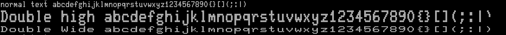
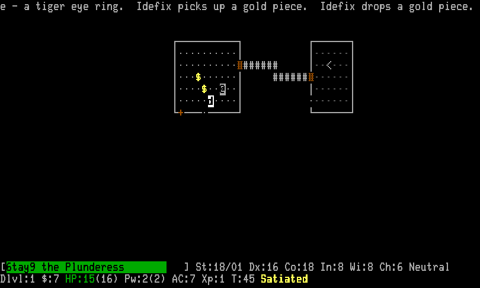

This is a faithful recreation of the DEC VT220 fonts, in bitmap font format, using a VT220 rom dump and performing the same operations on the pixels as described in the VT220 technical manual. The only departure is that the bitmap is stretched 2x vertically since the vertical pixel density of the VT220 was about 1/2 it's horizontal pixel density.

Fonts with 150 x resolution are double width and have been created by doubling the width before stretching as per the DEC manual

Additionally, I have added a few new characters based on the original characters, mostly related to the General Punctuation unicode block (U+2000 - U+206F) since they are encountered regularly when using a terminal based web browser. Bold/italic/bolditalic fonts (generated using mkbolditalic) are also included although they are anachronistic to 

It includes both 80col and 136col fonts.

* Installation
Fonts are provided at a variety of sizes in the =dist/fonts= folder.

- Use =bdf= for X core-font clients such as =xterm=. This is the recommended format when you want DEC/xterm double-width and double-height line controls to use matching bitmap masters.
- Use =otb= for fontconfig/Xft applications.
- Use =psf= for the Linux console with =setfont=.

** Recommended xterm install: default 80-column size
Most users only need the default 80-column 10x20 font plus the two bitmap masters that =xterm= can use for VT-style double-width and double-height lines:

| Purpose | File |
|---------+------|
| normal/default line | =DIGITAL-VT220-Normal-80col-10x20-75xres.bdf= |
| double-width line (=ESC # 6=) | =DIGITAL-VT220-Normal-80col-20x20-150xres.bdf= |
| double-width/double-height line halves (=ESC # 3= / =ESC # 4=) | =DIGITAL-VT220-Normal-80col-20x40-75xres.bdf= |

Install those BDFs into a per-user font directory:

#+BEGIN_SRC bash
git clone https://github.com/htayj/DEC-Fonts.git
cd DEC-Fonts

install_dir="$HOME/.local/share/fonts/digital-vt220-bdf"
mkdir -p "$install_dir"

cp \
  dist/fonts/bdf/DIGITAL-VT220-Normal-80col-10x20-75xres.bdf \
  dist/fonts/bdf/DIGITAL-VT220-Normal-80col-20x20-150xres.bdf \
  dist/fonts/bdf/DIGITAL-VT220-Normal-80col-20x40-75xres.bdf \
  "$install_dir"/

# Optional, but recommended if you configure xterm to use real bold fonts.
cp \
  dist/fonts/bdf/DIGITAL-VT220-Normal-80col-Bold-10x20-75xres.bdf \
  dist/fonts/bdf/DIGITAL-VT220-Normal-80col-Bold-20x20-150xres.bdf \
  dist/fonts/bdf/DIGITAL-VT220-Normal-80col-Bold-20x40-75xres.bdf \
  "$install_dir"/

(cd "$install_dir" && mkfontscale && mkfontdir)
fc-cache -fv "$install_dir"

# This affects the current X session. Put the two xset lines in ~/.xprofile
# or ~/.xinitrc if you want them applied automatically at login.
xset +fp "$install_dir"
xset fp rehash
#+END_SRC

Then configure =xterm= in =~/.Xresources=:

#+BEGIN_SRC Xdefaults
! Use X core fonts rather than Xft so xterm can load the BDF XLFDs above.
XTerm*renderFont: false

! Keep xterm's VT102 double-size-line support enabled.  This is true by
! default, but setting it here documents that ESC # 3/# 4/# 6 are expected
! to use matching bitmap fonts rather than spacing-only simulation.
XTerm*fontDoublesize: true
XTerm*cacheDoublesize: 8

*VT100.font: -digital-vt220-medium-r-normal-80col-20-200-75-75-c-100-iso10646-1
*VT100.wideFont: -digital-vt220-medium-r-normal-80col-20-200-150-75-c-200-iso10646-1

! Include these two lines if you installed the optional Bold BDFs above.
*VT100.boldFont: -digital-vt220-bold-r-normal-80col-20-200-75-75-c-100-iso10646-1
*VT100.wideBoldFont: -digital-vt220-bold-r-normal-80col-20-200-150-75-c-200-iso10646-1
#+END_SRC

Load the resources:

#+BEGIN_SRC bash
xrdb -merge ~/.Xresources
#+END_SRC

You can test the result with the included script:

#+BEGIN_SRC bash
xterm -fn '-digital-vt220-medium-r-normal-80col-20-200-75-75-c-100-iso10646-1' \
  -e ./fonttest
#+END_SRC

The double-width section should use the 20x20/150-xres font. The double-height section should use the 20x40 font for the top and bottom halves. The most noticeable difference is that double-width =p= and =q= should have a small separation between the top of the stem and bowl; in the 20px font the top of the character is not a continuous line.

** Full BDF install
If you want every generated size/style, copy all BDF files instead of the minimal set:

#+BEGIN_SRC bash
git clone https://github.com/htayj/DEC-Fonts.git
cd DEC-Fonts

install_dir="$HOME/.local/share/fonts/digital-vt220-bdf"
mkdir -p "$install_dir"
cp dist/fonts/bdf/*.bdf "$install_dir"/
(cd "$install_dir" && mkfontscale && mkfontdir)
fc-cache -fv "$install_dir"
xset +fp "$install_dir"
xset fp rehash
#+END_SRC

You may need to restart running fontconfig/Xft applications before the font becomes an option. =xset +fp= is per X session, so add it to your X startup files for permanent xterm/core-font use.

* Building
Run the Common Lisp generator from the repository root with SBCL and Quicklisp:

#+BEGIN_SRC bash
sbcl --load "$HOME/quicklisp/setup.lisp" \
     --eval '(asdf:load-asd (merge-pathnames "dec-fonts.asd" (uiop:getcwd)))' \
     --eval '(ql:quickload :dec-fonts)' \
     --eval '(dec-fonts.generator:main)' \
     --quit
#+END_SRC

This regenerates =dist/dec.set= and the base BDF files in =dist/fonts/bdf=.
The generator is loadable as the ASDF system =dec-fonts=; loading the system does not write files. Call =dec-fonts.generator:generate= or =dec-fonts.generator:main= to generate fonts explicitly.

To verify a refactor against a previously captured baseline, use:

#+BEGIN_SRC bash
scripts/check-generated.sh /path/to/baseline-directory
#+END_SRC

The baseline directory must contain =cl-generated.sha256=, for example from =sha256sum= over =dist/dec.set= and the base non-bold/non-italic BDF files before making changes.

To generate the otb and psf fonts, alongside bold/italic, run convert.bash ( bdf2psf required for the psf fonts and [[http://hp.vector.co.jp/authors/VA013651/freeSoftware/mkbold-mkitalic.html][mkbolditalic]] required for bold/italic):

#+BEGIN_SRC bash
./convert.bash
#+END_SRC

The conversion script is safe to repeat: it processes only the base BDF files, removes stale generated style variants, regenerates OTB/PSF outputs, and refreshes =fonts.dir= / =fonts.scale=.

To audit BDF/XLFD metadata after generation or conversion, run:

#+BEGIN_SRC bash
python3 scripts/check-bdf-metadata.py dist/fonts/bdf
#+END_SRC

The generated BDF metadata follows BDF 2.1 and XLFD conventions: =SIZE= uses point size plus x/y resolution, =POINT_SIZE= is decipoints, 150-xres fonts set =RESOLUTION_X= to 150 and =RESOLUTION_Y= to 75, =SWIDTH= is derived from =DWIDTH=, point size, and x-resolution, and =DEFAULT_CHAR= points at U+25C6 (diamond). Base and bold fonts are marked character-cell (=SPACING "c"=); italic and bold-italic derived fonts are marked monospace (=SPACING "m"=) because their slanted ink can overhang the cell.

* Screenshots
 

* Acknowledgements
Giant thank you to Paul Flo Williams for creating vt100.net, which provided the rom dump image (rom-separated.png) that is parsed to create the font along with the instructions on how the font is created

https://www.vt100.net/dec/vt220/glyphs

* See Also
- [[https://web.archive.org/web/20160908194141/http://www.vtxemu.com/download.html][DEC Terminal Modern]] - a TTF modern interpretation of the VT220 font.
- [[https://github.com/svofski/glasstty][GlassTTY]] - a TTF version of the font with scan lines 

 
* [[file:TODOs.org][TODO-List]]
